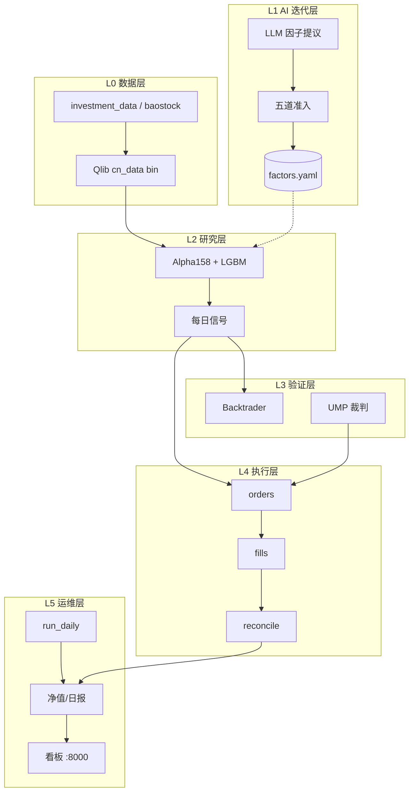

# A 股 AI 量化交易系统

[](https://www.python.org/downloads/)
[](LICENSE)

面向 **沪深 A 股** 的分层量化系统：从 **AI 因子挖掘 → Qlib 研究回测 → Backtrader 独立复演 → 人工/模拟实盘闭环 → Web 看板监控**，强调 **低换手、可复现、防过拟合、回测与执行口径一致**。

> **核心代码在 [`quant/`](quant/) 目录**（约 5k 行自研 Python）。  
> 同目录下的 `qlib/`、`backtrader/`、`vnpy/`、`rd-agent/`、`abu/` 为上游开源项目的**本地只读引用**，便于对照学习，**不是本仓库的维护范围**。

---

## 项目亮点

| 亮点 | 说明 |
|------|------|
| **全链路分层架构** | L0 数据 → L2 Qlib 研究 → L3 Backtrader 验证 → L4 执行 → L5 运维看板；层间仅通过 **CSV 数据契约** 通信，可独立替换升级 |
| **「换手率是生命线」** | 实证：毛超额 IR 0.6~0.8，高换手净 IR 一度 **−0.17**；引入 **5 日标签 + hold_thresh=10** 后净 IR **1.04**、年化净超额 **+9.3%** |
| **双引擎交叉验证** | Qlib 向量化回测 + Backtrader 事件驱动复演（T+1 / 涨跌停 / 停牌 / 整手 / 费税）；复演与 Qlib 年化差异 **≤3pct** 才放行 |
| **UMP 信号二次否决** | 借鉴 abu「裁判」思想自研 LightGBM 拦截器，样本外 A/B 超额 IR **0.21 → 0.48**，无 abu 运行时依赖 |
| **LLM 因子挖掘 + 五道准入** | 自研轻量 RD-Agent 式闭环；15 个 LLM 候选仅 **2 个** 进入纸面跟踪，漏斗有效拦截 AI 过拟合 |
| **研究线 + 实盘线双线并行** | 10 万模拟线自动成交 vs 1 万实盘线人工回填；同一信号源，隔离账本，可量化「执行偏差」 |
| **路线一友好落地** | 无需 miniQMT 即可起步：系统出单、同花顺手动下单、收盘回填成交；看板 + 内置定时一键常驻 |
| **可复现** | MLflow / Qlib Recorder 记录实验；YAML 配置入仓；跨层 CSV 经 `schemas.py` 校验 |

---

## 流程图

> Cursor / 部分 Markdown 预览**不支持 Mermaid**，只能看到代码块。  
> 下面每张图都有 **ASCII 版**（直接可见）；完整六张图见 **[docs/FLOWCHARTS.md](docs/FLOWCHARTS.md)**。  
> 推到 **GitHub** 在线查看 README 时，Mermaid 会自动渲染成图形。

### 1. 分层系统架构

```
┌─────────────────────────────────────────────────────────────────────────┐
│ L5 运维  run_daily · 净值/日报 · 监控 · FastAPI 看板 :8000              │
├──────────────────── CSV 契约 ───────────────────────────────────────────┤
│ L4 执行  make_trade_plan → record_fills → reconcile                     │
├──────────────────── 信号 score ─────────────────────────────────────────┤
│ L3 验证  Backtrader 复演 · UMP 裁判                                     │
├──────────────────── 因子/模型 ──────────────────────────────────────────┤
│ L2 研究  Qlib Alpha158+LGBM · predict_daily    │ L1  LLM→准入→因子库   │
├──────────────────── Qlib bin ───────────────────────────────────────────┤
│ L0 数据  investment_data · baostock · 质检                               │
└─────────────────────────────────────────────────────────────────────────┘
```

<details>
<summary>Mermaid 版（GitHub 可渲染）</summary>



</details>

### 2. 研究 → 验证 → 上线

```
[下载数据] → [run_baseline] → IR≥0.8? ─否→ [调 hold_thresh/topk/标签] ─┐
                  ↑                              │                      │
                  └────────────── 否 ────────────┘                      │
                  │是                                                  │
                  ▼                                                     │
         [Backtrader 复演] → 差异≤3pct? ─否─────────────────────────────┘
                  │是
                  ▼
         [predict_daily] → [双线 evening/postclose 闭环]
```

### 3. 每日闭环（路线一）

```
22:30 evening(自动)  更新数据 → 信号 → 调仓清单(UMP) → orders/
        ↓
次日 9:30~10:00(人工)  同花顺照单下单
        ↓
收盘后(人工)  record_fills 录入实际成交
        ↓
23:30 postclose(自动)  对账 → 净值 → 日报 → 看板

研究线 research_sim_100k：自动 simulate_fills
实盘线 live_manual_10k：fills 由用户回填
```

### 4. LLM 因子准入漏斗

```
LLM提议 → ①初筛 → ②去重 → ③样本外 → ④经济逻辑 → ⑤组合增量
              ↓        ↓         ↓          ↓            ↓
          rejected  rejected  rejected   rejected   passed_auto
                                                         ↓
                                              paper_tracking(1~3月)
                                                         ↓
                                                    live 并入模型
```

更多流程图（时序图、双线对比、看板调度）→ **[docs/FLOWCHARTS.md](docs/FLOWCHARTS.md)**

---

## 快速开始

### 1. 环境

```bash
git clone <your-repo-url> quant-system && cd quant-system
python3 -m venv quant-venv
quant-venv/bin/pip install -r quant/requirements.txt
```

**要求**：Python 3.10 · 内存 ≥3GB · 磁盘 ≥5GB（建议 8GB swap）

### 2. 市场数据（首次）

```bash
# 推荐：investment_data 社区 Qlib bin 包（含历史成分股，无幸存者偏差）
# 下载 release 的 qlib_bin.tar.gz 解压到 ~/.qlib/qlib_data/cn_data
# 详见：https://github.com/chenditc/investment_data

# 每日增量（收盘后）
quant-venv/bin/python quant/data_pipeline/update_daily.py
```

### 3. 跑通研究基线

```bash
cd quant
../quant-venv/bin/python research/run_baseline.py
# 产出：data/reports/baseline_*.md · MLflow · data/signals/latest_pred.csv
```

**当前基线口径**（已通过阶段 1 验收）：

- 标的池：中证 500 · 模型：Alpha158 + LightGBM  
- 组合：TopK50 / n_drop3 / **hold_thresh=10** · 标签：**5 日开盘价收益**  
- 测试期样本外：**净 IR 1.04**，年化净超额 **+9.3%**

### 4. 独立复演验证（阶段 2）

```bash
../quant-venv/bin/python validation/replay_backtrader.py
../quant-venv/bin/python validation/ump_judge.py train
```

### 5. LLM 因子迭代（阶段 3，可选）

```bash
cp configs/secret.env.example configs/secret.env   # 填入 LLM_API_KEY 等，切勿提交 git
../quant-venv/bin/python factor_lab/run_iteration.py --iters 3 --k 5
```

### 6. 双线账户 + 看板（阶段 4/5a）

```bash
# 回填最近一周，让看板启动即有数据
../quant-venv/bin/python ops/backfill.py --days 6

# 启动常驻看板（FastAPI + 内置 APScheduler）
bash webapp/serve.sh start 8000
# 浏览器打开 http://<host>:8000
```

账户配置见 `configs/accounts/`：

| 账户 | 用途 | 模式 |
|------|------|------|
| `research_sim_100k` | 10 万研究模拟线 | 系统自动按次日开盘价模拟成交 |
| `live_manual_10k` | 1 万实盘线 | 试运行 `simulated` / 正式 `manual` + 人工回填 fills |

---

## 日常使用命令

```bash
cd quant

# --- 晚间：生成次日调仓清单 ---
../quant-venv/bin/python ops/run_daily.py --stage evening --account research_sim_100k --ump
../quant-venv/bin/python ops/run_daily.py --stage evening --account live_manual_10k --ump

# --- 实盘线：收盘后回填成交 ---
../quant-venv/bin/python execution/record_fills.py --account live_manual_10k \
  --day <成交日> --order-day <订单日> --template
# 编辑 data/accounts/live_manual_10k/fills/<成交日>.csv 后：
../quant-venv/bin/python execution/record_fills.py --account live_manual_10k --day <成交日> --apply

# --- 晚间：对账 / 净值 / 日报 ---
../quant-venv/bin/python ops/run_daily.py --stage postclose --account live_manual_10k \
  --day <成交日> --order-day <订单日>

# --- 双线复盘 ---
../quant-venv/bin/python ops/review_accounts.py --research research_sim_100k --live live_manual_10k
```

> 不跑看板服务时，可用 `ops/crontab.example` 配置系统 cron（与看板内置定时**二选一**）。

---

## 目录结构

```
quant/
├── data_pipeline/     # L0：抓取、质检、日更
├── research/          # L2：Qlib 工作流、训练、每日信号
├── factor_lab/        # L1：LLM 因子挖掘 + 准入 + 因子库
├── validation/        # L3：Backtrader 复演 + UMP 裁判
├── execution/         # L4：调仓清单、成交回填、对账
├── ops/               # L5：编排、净值、日报、监控、回填
├── webapp/            # L5：FastAPI 看板 + APScheduler
├── contracts/         # 跨层 CSV schema 校验
├── configs/           # global.yaml + accounts/*.yaml
└── data/              # 运行时数据（gitignore，按账户隔离）
```

详细设计与阶段验收见 [`设计实现方案.md`](设计实现方案.md)，模块级说明见 [`quant/README.md`](quant/README.md)。

---

## 阶段进度

| 阶段 | 内容 | 状态 |
|------|------|------|
| 1 | 数据 + Qlib 基线（IR≥0.8） | ✅ |
| 2 | Backtrader 独立复演 + 滑点敏感性 | ✅ |
| 2b | UMP 裁判二次否决 | ✅ |
| 3 | LLM 因子迭代 + 五道准入 | ✅ |
| 4 | 路线一每日闭环（编排/回填/对账/日报） | 🛠 工具就绪，连续 20 日验收进行中 |
| 5a | Web 看板 + 内置定时 + 双线试运行 | 🛠 试运行中 |
| 5 | miniQMT 全自动（vn.py） | 📋 规划中 |

---

## 配置说明

| 文件 | 用途 |
|------|------|
| `configs/global.yaml` | 标的池、基准、默认策略参数、费率、风控 |
| `configs/accounts/*.yaml` | 分账户资金、topk、模式（simulated/manual） |
| `configs/secret.env` | LLM API 凭证（**gitignore，勿提交**） |
| `research/workflow_baseline.yaml` | Qlib 训练/回测/组合完整配置 |

---

## 上游致谢

本站在巨人肩上，核心能力来自以下开源项目（本地 clone 仅供对照，**自研代码在 `quant/`**）：

- [Microsoft Qlib](https://github.com/microsoft/qlib) — AI 量化研究与回测  
- [Backtrader](https://github.com/mementum/backtrader) — 事件驱动回测  
- [VeighNa (vn.py)](https://github.com/vnpy/vnpy) — 实盘通道（阶段 5 规划）  
- [Microsoft RD-Agent](https://github.com/microsoft/RD-Agent) — 因子迭代思想参考  
- [Abu Quant](https://github.com/bbfamily/abu) — UMP 裁判思想参考  
- [investment_data](https://github.com/chenditc/investment_data) — A 股 Qlib 数据包  

---

## 风险声明

- 本项目仅供 **学习与研究**，不构成任何投资建议。  
- 历史回测表现 **不代表** 未来收益；AI 挖掘因子存在 **过拟合** 风险，请务必走完准入与纸面跟踪流程。  
- 实盘前请用小资金验证，并理解 A 股 **T+1、涨跌停、停牌** 等制度约束。  

---

## 贡献与 License

欢迎 Issue / PR。提交前请确保：

- 不提交 `configs/secret.env`、`data/`、API Key  
- 新 CSV 契约走 `contracts/schemas.py`  
- 研究/验证/执行三层调仓逻辑保持一致（TopkDropout + hold_thresh）

License: [MIT](LICENSE)（请随仓库一并添加 LICENSE 文件）

---

## 延伸阅读

- **[docs/FLOWCHARTS.md](docs/FLOWCHARTS.md)** — 全部流程图（ASCII + Mermaid 双版本）  
- [quant/README.md](quant/README.md) — 模块手册与命令索引  
- [设计实现方案.md](设计实现方案.md) — 完整架构、时间线、风险表、阶段验收  
