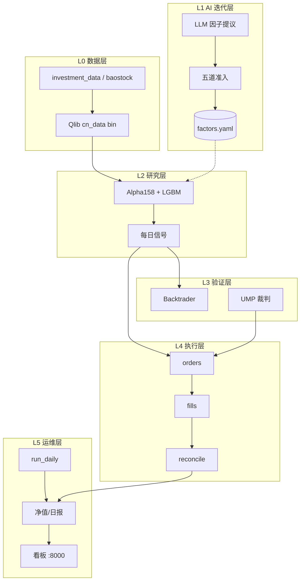
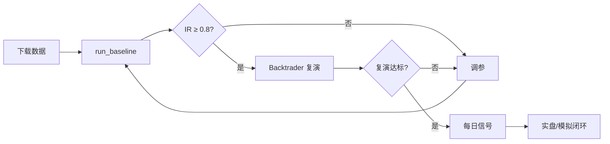
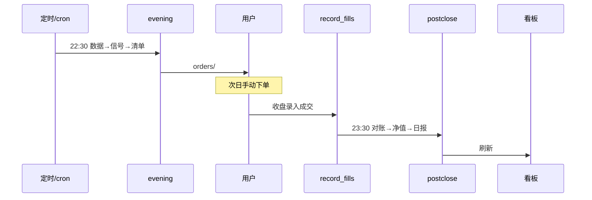
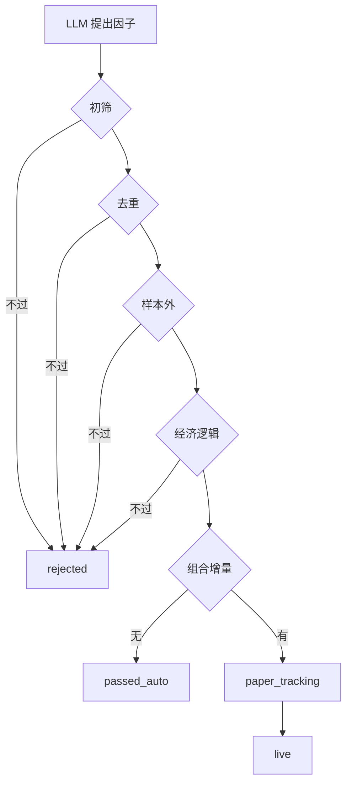

# 系统流程图

> **说明**：下文每张图提供 **ASCII 版**（任意编辑器可见）和 **Mermaid 版**（GitHub / 支持 Mermaid 的预览器可渲染）。  
> 若你只能看到代码块，请直接看 ASCII 图，或把本文件推到 GitHub 在线查看。

---

## 1. 分层系统架构

### ASCII

```
┌─────────────────────────────────────────────────────────────────────────┐
│ L5 运维层  ops/ + webapp/                                                │
│   run_daily 编排 · 净值/日报 · 监控告警 · FastAPI 看板 :8000              │
├─────────────────────────── CSV 契约 ──────────────────────────────────────┤
│ L4 执行层  execution/                                                    │
│   make_trade_plan(调仓清单) → record_fills(成交) → reconcile(对账)         │
├─────────────────────────── 信号 score ───────────────────────────────────┤
│ L3 验证层  validation/                                                   │
│   Backtrader 独立复演(T+1/涨跌停/整手/费税) · UMP 裁判二次否决            │
├─────────────────────────── 因子/模型 ────────────────────────────────────┤
│ L2 研究层  research/          │ L1 AI层  factor_lab/                      │
│   Qlib Alpha158+LGBM          │   LLM提议 → 五道准入 → factors.yaml       │
│   predict_daily 每日信号       │   (纸面跟踪达标后才并入模型)               │
├─────────────────────────── Qlib bin ─────────────────────────────────────┤
│ L0 数据层  data_pipeline/                                                │
│   investment_data 主路径 · baostock 增量 · 质检 · ~/.qlib/qlib_data       │
└─────────────────────────────────────────────────────────────────────────┘

数据流：L0 → L2 训练/推理 → L3 验证通过 → L4 出单执行 → L5 监控
         L1 因子库 ──(跟踪达标)──→ L2 特征集
         L3 UMP ──→ L4 买入否决
```

### Mermaid



---

## 2. 研究 → 验证 → 上线

### ASCII

```
  [下载 Qlib 数据]
         │
         ▼
  [run_baseline 训练+回测]
         │
         ▼
   样本外 IR ≥ 0.8 ? ──否──→ [调 hold_thresh / topk / 标签] ──┐
         │是                                                    │
         ▼                                                      │
  [Backtrader 独立复演]                                         │
         │                                                      │
         ▼                                                      │
  与 Qlib 差异≤3pct 且滑点达标 ? ──否───────────────────────────┘
         │是
         ▼
  [predict_daily 每日信号]
         │
         ▼
  [双线账户 evening/postclose 闭环]
         │
         ▼
  [连续 20 日验收 · 跟踪偏差 ≤2pct]
```

### Mermaid



---

## 3. 每日闭环（路线一 · 人工下单）

### ASCII

```
  22:30 evening (自动)
  ┌──────────────────────────────────────────┐
  │ update_daily → predict_daily             │
  │ → make_trade_plan(+UMP) → orders/        │
  └──────────────────────────────────────────┘
         │
         │  清单推送 / 看板展示
         ▼
  次日 9:30~10:00 (人工)
  ┌──────────────────────────────────────────┐
  │ 用户在同花顺照 orders/ 下单               │
  └──────────────────────────────────────────┘
         │
         ▼
  收盘后 (人工)
  ┌──────────────────────────────────────────┐
  │ record_fills --template → 改实际成交价    │
  │ record_fills --apply                      │
  └──────────────────────────────────────────┘
         │
         ▼
  23:30 postclose (自动)
  ┌──────────────────────────────────────────┐
  │ monitor → reconcile → compute_nav         │
  │ → daily_report → 看板/告警                │
  └──────────────────────────────────────────┘

  研究线 research_sim_100k：postclose 内自动 simulate_fills（无需人工）
  实盘线 live_manual_10k：fills 必须由用户回填
```

### Mermaid



---

## 4. LLM 因子五道准入（防过拟合）

### ASCII

```
                    [LLM 提出因子]
                           │
                           ▼
              ┌─ 关卡1 初筛 ─ IC/ICIR/换手 ─┐
              │  不过 → rejected            │
              └────────────┬────────────────┘
                           │过
                           ▼
              ┌─ 关卡2 去重 ─ 相关<0.7 ────┐
              │  不过 → rejected            │
              └────────────┬────────────────┘
                           │过
                           ▼
              ┌─ 关卡3 样本外 OOS IC ──────┐
              │  不过 → rejected            │
              └────────────┬────────────────┘
                           │过
                           ▼
              ┌─ 关卡4 经济逻辑非空 ───────┐
              │  不过 → rejected            │
              └────────────┬────────────────┘
                           │过
                           ▼
              ┌─ 关卡5 组合增量 ───────────┐
              │  无增量 → passed_auto       │
              │  有增量 → paper_tracking    │
              └────────────┬────────────────┘
                           │
                           ▼
              [纸面跟踪 1~3 月，监控线上 IC]
                           │
                           ▼
                    [live → 并入 LGBM 模型]
```

### Mermaid



---

## 5. 双线账户对比

### ASCII

```
                    ┌─── 共享 ───┐
                    │ Qlib 信号   │
                    │ UMP 否决    │
                    │ 风控预检    │
                    └──────┬─────┘
                           │
           ┌───────────────┴───────────────┐
           ▼                               ▼
  research_sim_100k                 live_manual_10k
  资金 10 万 · TopK50              资金 1 万 · TopK5
  mode: simulated                   mode: simulated→manual
  次日开盘价自动成交                 人工下单 + 回填 fills
  data/accounts/research_sim_100k/  data/accounts/live_manual_10k/
           │                               │
           └──────── review_accounts ──────┘
                    比较收益/滑点/偏差
```

---

## 6. 看板与常驻调度（阶段 5a）

### ASCII

```
  bash webapp/serve.sh start 8000
         │
         ▼
  ┌─────────────────────────────────────┐
  │  FastAPI 看板 (0.0.0.0:8000)         │
  │  · 双线净值/超额对比                  │
  │  · 持仓/成交/报告                     │
  │  · 个股 K 线 (东财 → qlib 回退)       │
  ├─────────────────────────────────────┤
  │  APScheduler 内置定时                 │
  │  22:30 evening (两账户)              │
  │  23:30 postclose (两账户)            │
  │  周五 23:45 双线复盘                 │
  └─────────────────────────────────────┘
```
