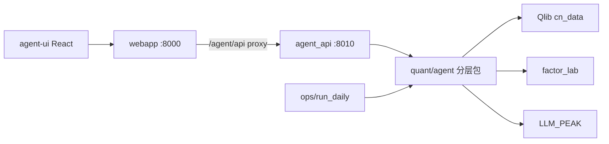
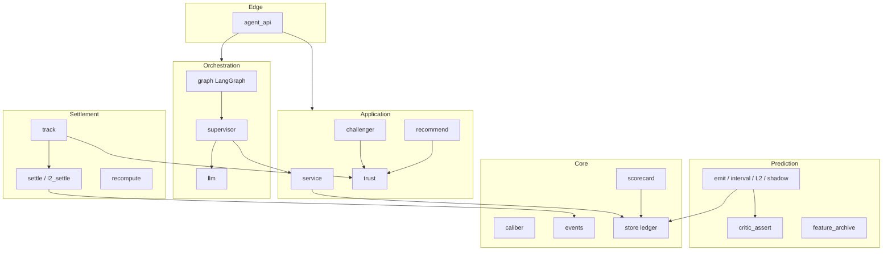
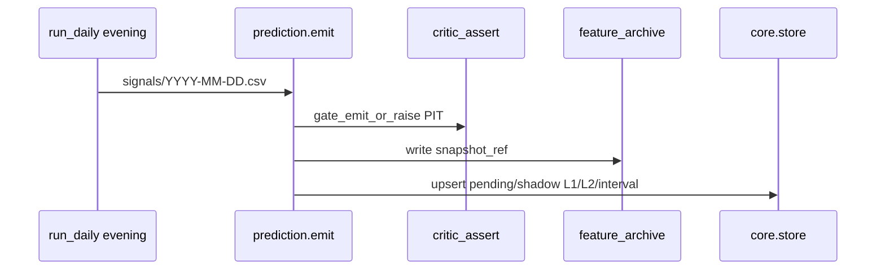
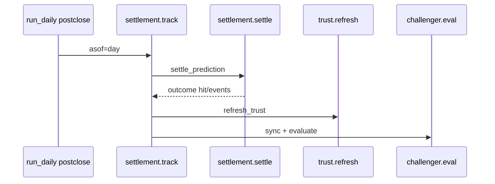

# Quant Analysis Agent — 架构设计

> 权威实现架构。产品原则与结算口径见 [QUANT_AGENT_PLAN.md](./QUANT_AGENT_PLAN.md)；**日常操作见 [QUANT_AGENT_USAGE.md](./QUANT_AGENT_USAGE.md)**；本文件描述**分层边界、模块地图、数据流与部署**。

## 1. 目标与原则

- **只分析、不交易**：评估预测质量，不下单。
- **LLM 编排、代码算账**：claim / hit / 权重全部由确定性代码产生；LLM 只选工具与叙述。
- **双时间线**：`factor_lab` 回测准入 ≠ 在线追踪校准。
- **口径可升级可重算**：`settlement_caliber` 版本化；历史 outcome 按口径并存。

## 2. 系统上下文



| 入口 | 职责 |
|------|------|
| `http://host:8000/agent/` | 静态 React；API 经 webapp 反代到 `:8010` |
| `agent_api :8010` | Edge：鉴权、DTO、demo 回退、路由 |
| `ops/run_daily` | evening emit / postclose track（子进程调 `agent/jobs`） |

## 3. 逻辑分层



### 硬边界

| 层 | 允许 | 禁止 |
|----|------|------|
| **Core** | 口径常量、账本 CRUD、成绩单纯函数 | 调 Qlib、调 LLM、写 HTTP |
| **Settlement** | 读行情、写 outcome、口径重算 | 改策略权重、调 LLM |
| **Prediction** | 写 pending/shadow、特征归档、lookahead 断言 | 结算 hit、调 LLM |
| **Trust** | 权重 / 晋升门 / 混权推荐 | 改 outcome 数值 |
| **Orchestration** | 选工具、叙述、LangGraph | 发明 claim / 改 hit |
| **Edge** | 鉴权、DTO、demo | 内嵌结算逻辑 |

## 4. 物理目录

```
quant/agent/
  core/             caliber, events, scorecard, store
  settlement/       settle, l2_settle, track, recompute
  prediction/       emit, interval_emit, l2_emit, shadow_emit,
                    feature_archive, critic_assert
  trust/            trust, gates, challenger, recommend
  orchestration/    supervisor, graph, llm, service
  jobs/             run_emit, run_track, run_shadow, run_tests
  tests/

quant/agent_api/    Edge FastAPI
quant/agent-ui/     React 控制台
```

Import 示例：`from agent.prediction.emit import emit_from_signals`；CLI：`python agent/jobs/run_emit.py --day …`。

数据落盘：

| 路径 | 内容 |
|------|------|
| `quant/data/agent/ledger.sqlite3` | 预测账本 + 策略注册表 |
| `quant/data/agent/features/` | 特征快照归档（JSON / parquet） |
| `quant/data/logs/` | webapp / agent_api PID 与日志 |

## 5. 关键数据流

### 5.1 Evening — 出预测



### 5.2 Postclose — Track 结算



## 6. API 映射（Edge → 层）

| 路由 | 层 |
|------|-----|
| `GET /api/health` | Edge + orchestration.llm.describe_route |
| `GET /api/system/status` | orchestration.service |
| `GET /api/predictions` | orchestration.service + trust.recommend blend |
| `GET /api/strategies` | trust.trust |
| `GET /api/calibration` | core.scorecard via service |
| `GET/POST /api/research/*` | trust.challenger |
| `GET /api/recommend/blend` | trust.recommend |
| `POST /api/admin/recompute` | settlement.recompute |
| `POST /api/supervisor/ask` | orchestration.graph → supervisor |

鉴权：IP 白名单（与 webapp 共用）+ 可选 `AGENT_API_TOKEN` Bearer；Supervisor 代理超时默认 600s。

## 7. 模块地图（实现）

| 包 | 模块 | 一句话 |
|----|------|--------|
| core | `caliber` | 冻结/升级结算口径与基准映射 |
| core | `events` | 涨跌停标注、ST 提前结算辅助 |
| core | `store` | SQLite 账本 |
| core | `scorecard` | Wilson / 分桶校准 |
| settlement | `settle` / `l2_settle` | L1/L2 确定性结算 |
| settlement | `track` | 到期批处理 |
| settlement | `recompute` | 口径升级全量重算 |
| prediction | `emit*` / `shadow_emit` | 信号 → 可结算预测 |
| prediction | `critic_assert` | lookahead / PIT 硬门 |
| prediction | `feature_archive` | 特征归档 |
| trust | `trust` / `gates` / `challenger` | L3 状态机与晋升 |
| trust | `recommend` | champion+promoted 混权 |
| orchestration | `service` | enrich + release_gate |
| orchestration | `supervisor` / `graph` / `llm` | 会话编排 |
| jobs | `run_*` | CLI 入口 |

Import 必须走分层路径（例如 `agent.settlement.settle`）；根目录不再保留兼容 shim。

## 8. 演进规则

1. 新结算规则 → 只进 `settlement` + bump `caliber` + 金标准测试 + `recompute`。
2. 新因子路径 → 只进 `prediction.shadow_emit` + `trust.challenger`；未晋升 `trust_weight=0`。
3. 新自然语言能力 → 只进 `orchestration`；禁止写 outcome。
4. 新增公开符号放在对应层包内；禁止在 `agent/` 根目录再堆业务模块。
5. 方案语义变更同步改 [QUANT_AGENT_PLAN.md](./QUANT_AGENT_PLAN.md)。

## 9. 相关产物

- 架构图（draw.io）：[diagrams/quant-agent-architecture.drawio](./diagrams/quant-agent-architecture.drawio)
- 产品：[PRODUCT.md](../PRODUCT.md)
- UI：[quant/agent-ui/README.md](../quant/agent-ui/README.md)
