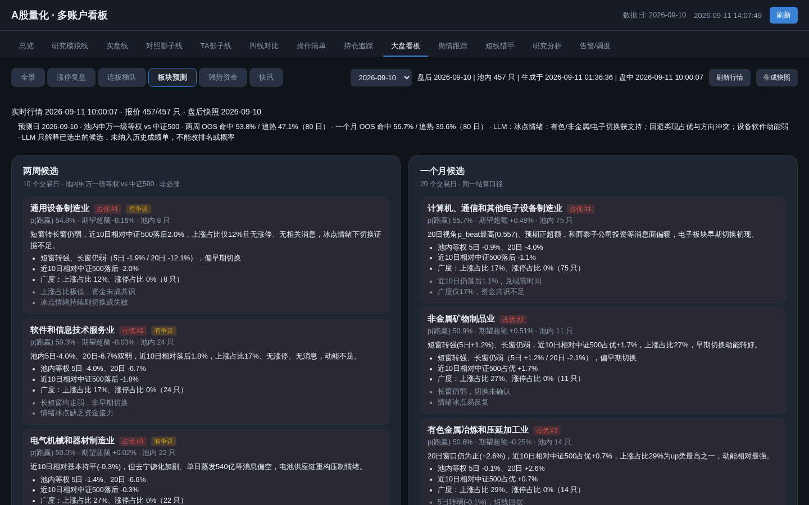
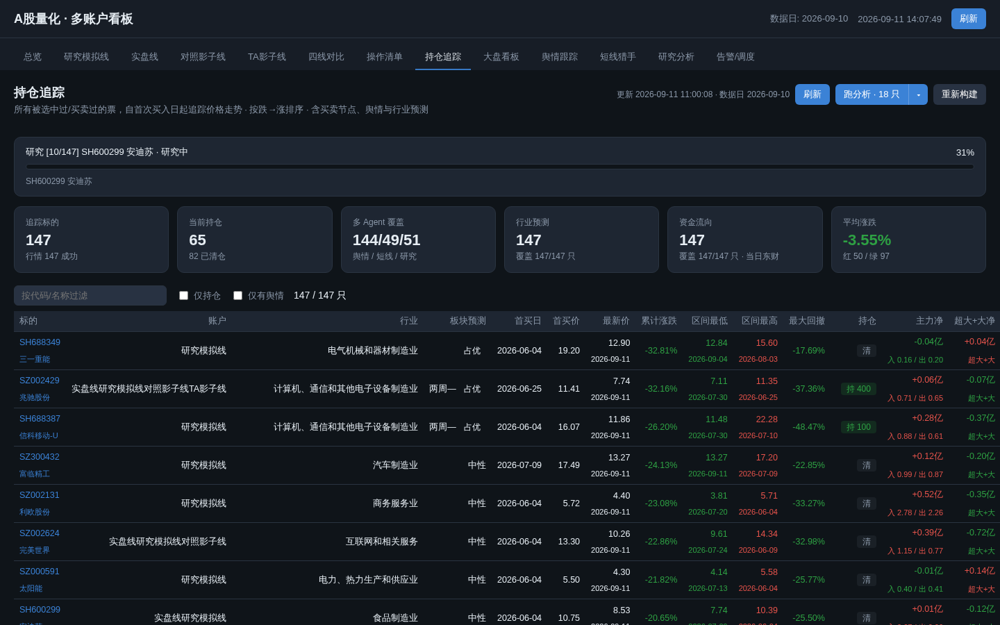

# 板块预测（sector_forecast）

只读 overlay：预测信号池内**申万一级**未来 10 / 20 个交易日相对中证 500 是否占优。
不改 `orders/`、不改 LGBM 主线。

## 口径

- 收益：池内该行业等权日收益（家数 < 3 不发）
- 基准：`SH000905`
- 窗口：预测日 T 收盘后发出，从 **T+1** 起算
- hit：窗口累计超额 > 0（up 看跑赢，avoid 看跑输）
- 每天每期限最多 3 条 up + 3 条 avoid
- 题材/舆情只做证据，不进主成绩单

OOS 命中率未显著优于「当日涨幅榜 Top3」时整段标 **shadow**，看板主区仍展示但带水印。

选出后用现有 `llm_router` 写理由 / 风险 / agree|challenge，**不能改排名或概率**；失败不影响数字预测。

## 命令

```bash
python overlays/sector_forecast/run_forecast.py              # 最新交易日（含 LLM 简报）
python overlays/sector_forecast/run_forecast.py --brief-only # 只补 LLM，不重训
python overlays/sector_forecast/run_forecast.py --skip-llm
python overlays/sector_forecast/test_schema.py
```

evening 在 `run_board` 之后自动跑（fail-open）。

产出：`data/overlays/sector_forecast/predictions/`、`models/`、`eval/`。

## 看板截图

大盘看板 → 子页签「板块预测」：



持仓追踪列表行内挂 `industry` + `sector_forecast` 徽章：


